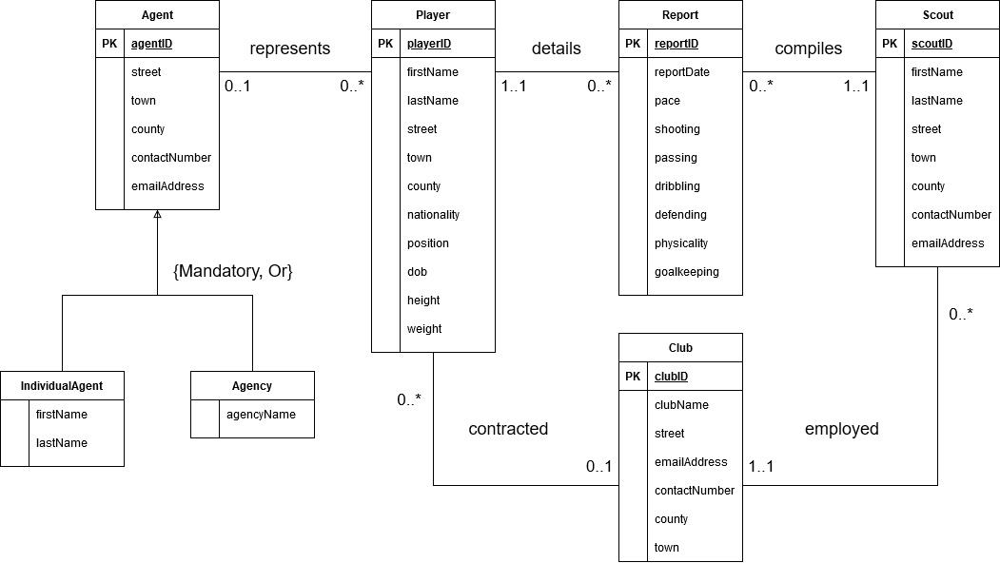

# Football Scouting Database

Scouting is an integral part of the modern-day game of football .Scouting is the process a football
club carries out to identify potential players to recruit to the team. While scouting is carried out at all
levels of football, the extent of a club’s scouting network is generally reflected in the finances
available to the club.

Storing this information in databases is beneficial for football scouts as it allows them to manage and
update data from one place. It allows them to compile scouting reports using this data and
share these reports with their colleagues. A scouting report is generally made up of numeric values
and short text entries, which makes a database an appropriate method for storing this data.

Functions of the Football Scouting Database include:
- Giving football scouts the ability to compile, analyse and compare detailed reports on
players.
- Allowing football teams to find players matching their requirements and track their progress.
- Giving agents the opportunity to find potential clients.
- Giving users the ability to track and analyse a player’s development.

### Scripts 

`create-and-insert.sql`:

- Creates tables
- Inserts data
- Creates trigger
- Creates common indexes
- Creates views

`common-queries.sql`:

- Common queries made to database
- Creates users
- Grants relevant permissions to users

### Enhanced ER Diagram

